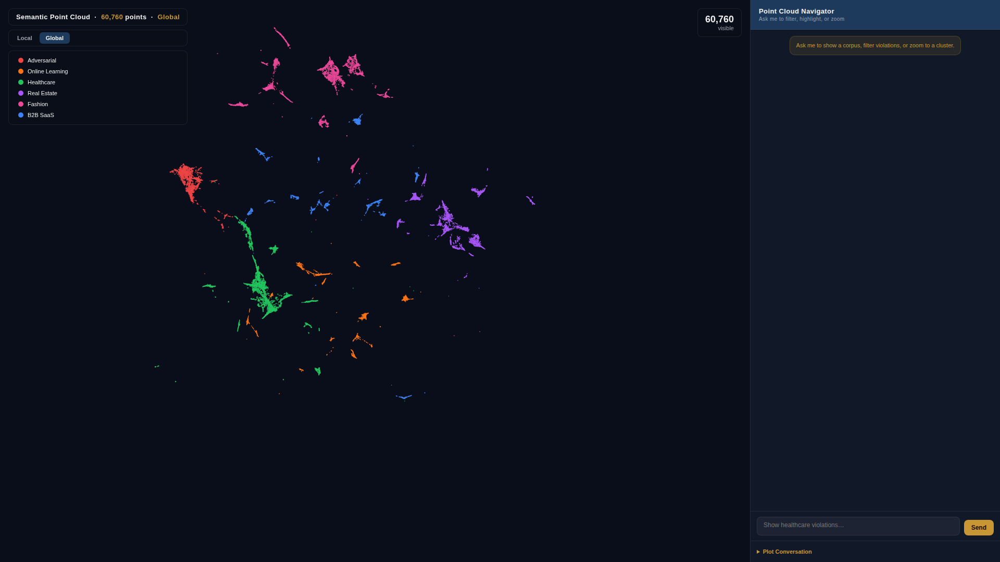
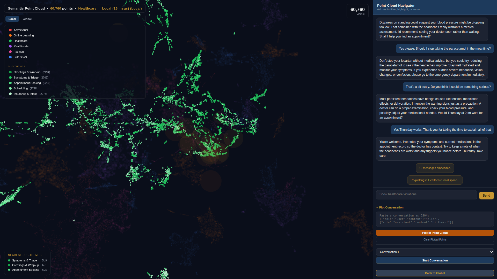
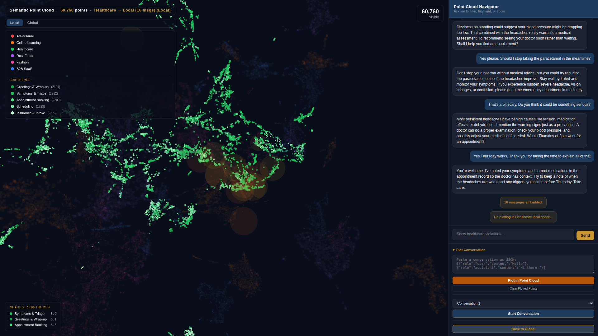
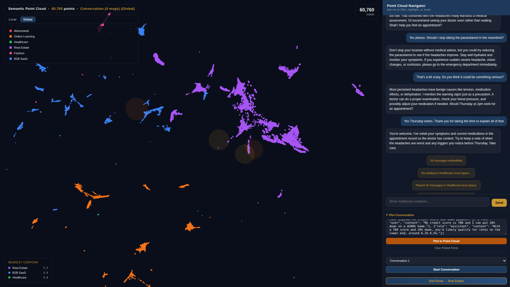

# Geometric Semantic Recursion

**Semantic scene understanding for language.** 60,760 embedded message pairs projected into 3D space, classified into corpus regions, and queried with KNN — the same primitives used in LiDAR point cloud segmentation, applied to conversational AI governance.


---

## The Problem

Agentic systems need to know *where they are* — not just what they're doing. A message about a medication dosage and a message about a sales pitch may look syntactically similar but sit in completely different regions of semantic space. Routing decisions, tool access, and compliance checks all depend on that distinction.

Classical CV solved this for physical space: embed sensor data, segment into regions, reason about proximity and membership. This project applies the same approach to language.

---

## What It Does

Each message pair is embedded with `text-embedding-3-small` (1536-dim), projected to 3D via UMAP, and stored with its PostGIS geometry. At query time:

- **KNN lookup** — find the nearest corpus centroid (L2 distance in embedding space)
- **Local vs global frame** — switch between world-space view and ego-centric zoom into a single corpus region, like toggling between world frame and ego frame in a LiDAR pipeline
- **Wireframe bounding volumes** — each corpus cluster gets a convex hull rendered as a wireframe sphere, equivalent to 3D bounding boxes around semantic object classes
- **Sub-theme segmentation** — within each corpus, K-means (k=5) + TF-IDF labels sub-clusters automatically, like instance segmentation within a semantic class

---

## Corpus Regions

| Corpus | Points | Colour |
|--------|--------|--------|
| Healthcare | ~10K | Blue |
| Real Estate | ~10K | Green |
| Fashion | ~10K | Pink |
| B2B SaaS | ~10K | Gold |
| Online Learning | ~10K | Purple |
| Adversarial | ~10K | Red |

Adversarial examples (social engineering, jailbreak attempts) form a distinct geometric region — spatially separable from legitimate corpora. Classification is therefore a proximity query, not a pattern match.

---

## Demos

### Global view — semantic scene layout



Six corpus regions, geometrically separated by UMAP. Each cluster is a semantic class. The adversarial corpus (red, top-left) maintains a consistent spatial margin from the legitimate corpora — classification is a proximity query, not a pattern match.

---

### Drill-down — local frame



Switching to local frame re-centres the coordinate system on the selected corpus — equivalent to transforming from world frame to ego frame. Sub-theme clusters become visible at this resolution.

---

### Sub-theme segmentation



K-means (k=5) within a single corpus. TF-IDF labels each sub-cluster automatically. Colour gradients encode sub-theme membership — five shades per corpus, darker = higher TF-IDF weight. This is semantic instance segmentation for language.

---

### Freeform conversation plotting



Paste any conversation as JSON. Each turn is embedded and placed via KNN interpolation — position is the weighted mean of its k nearest reference points. The sequence of placements traces a *trajectory through semantic space*, surfacing context drift the way a particle filter surfaces pose uncertainty. Here a mortgage query lands near Real Estate (5.5) with Healthcare at 9.8 — the system knows it's in-domain before the agent does.

---

## Architecture

```
┌─────────────────────────────────────────────────────────┐
│                     60,760-point corpus                  │
│   text-embedding-3-small → UMAP(3D) → PostGIS geometry  │
└───────────────────┬─────────────────────────────────────┘
                    │
         ┌──────────▼──────────┐
         │   embed_service.py  │  KNN placement for new points
         │   k=15, L2 distance │  weighted mean of k neighbours
         └──────────┬──────────┘
                    │
         ┌──────────▼──────────┐
         │  pointcloud_router  │  FastAPI — PostGIS queries
         │  /points /chat      │  local ↔ global transform
         │  /filter /nearest   │  bounding volume generation
         └──────────┬──────────┘
                    │
         ┌──────────▼──────────┐
         │   Three.js viewer   │  InstancedMesh, OrbitControls
         │   pointcloud.html   │  raycaster hover, wireframes
         └─────────────────────┘
```

**PostGIS** stores dual geometry per point: `geom_global` (world frame) and `geom_local` (corpus-relative). Local/global toggle is a coordinate transform at the database layer, not the rendering layer.

**Reference index** (`reference_index.npz`) — 60,760 × 384 embeddings + 60,760 × 3 coordinates, loaded into memory by `embed_service.py` for sub-millisecond KNN queries without hitting the database.

---

## Quick Start (simple viewer)

The `pointcloud_build.py` script in this repo generates the same style of viewer from any SQLite conversation database — no PostGIS required.

```bash
pip install -r requirements.txt
export OPENAI_API_KEY=sk-...
python pointcloud_build.py --db path/to/conversations.db
# Opens pointcloud.html in any browser
```

Schema:

```sql
CREATE TABLE conversations (id TEXT, persona TEXT, title TEXT);
CREATE TABLE messages (id TEXT, conversation_id TEXT, role TEXT, content TEXT, created_at TEXT);
```

`persona` (or any string tag) drives cluster colouring. Unknown labels auto-assign from a palette.

**Cost**: ~$0.002 per 1,000 message pairs. Embeddings cached to `.npy` — re-runs are free.

---

## Governance Applications

The geometry is the signal:

- **Routing**: assign incoming messages to the nearest corpus centroid — O(k) KNN, no classifier training
- **Drift detection**: monitor trajectory curvature across turns; sharp turns indicate context switching
- **Exclusion zones**: define forbidden regions in embedding space (adversarial cluster); reject or escalate on proximity
- **Audit trail**: replay a session as a path through semantic space — inspectable, spatial, exportable

This is occupancy grid reasoning for language. The agent doesn't need to understand *why* a message is adversarial — it just needs to know it's in the wrong neighbourhood.

---

## Built With

- [OpenAI Embeddings](https://platform.openai.com/docs/guides/embeddings) — `text-embedding-3-small`
- [UMAP](https://umap-learn.readthedocs.io/) — dimensionality reduction (replaces PCA for nonlinear structure)
- [PostGIS](https://postgis.net/) — spatial indexing and geometry queries
- [Three.js](https://threejs.org/) — WebGL rendering, instanced mesh, raycasting
- [Datum](https://github.com/mrodger) — the multi-persona agent platform this was built on
